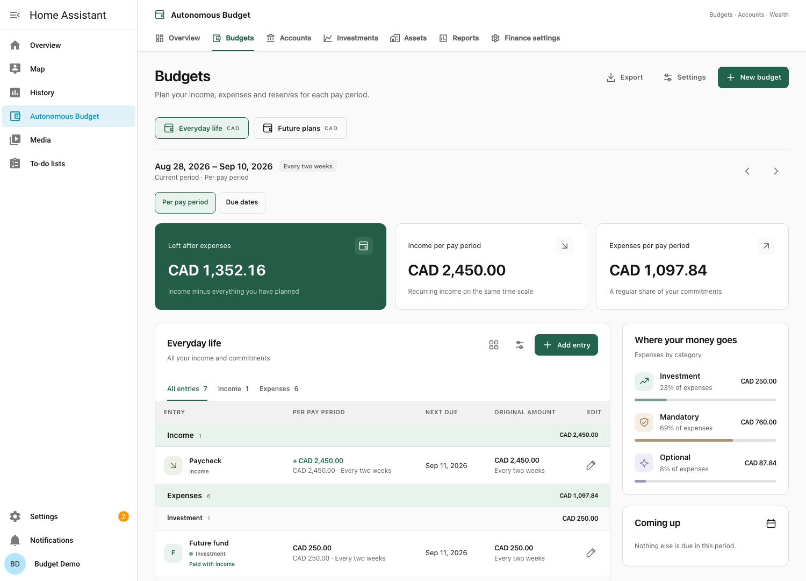
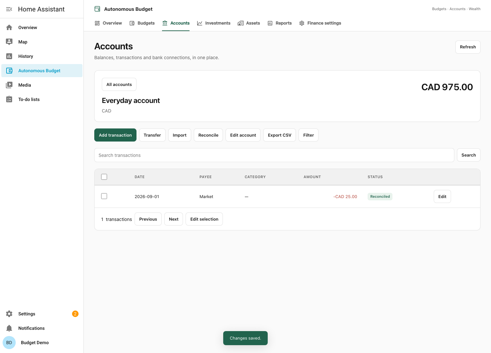
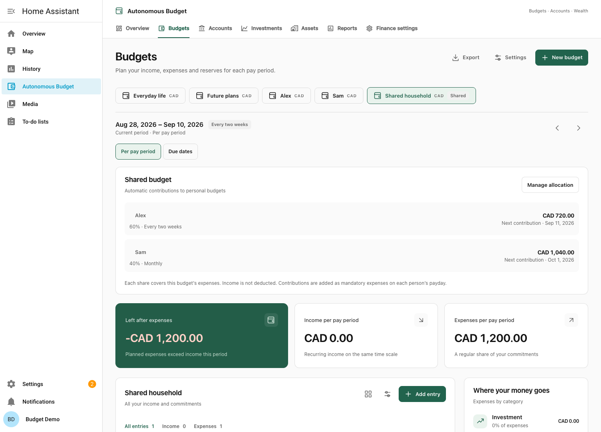
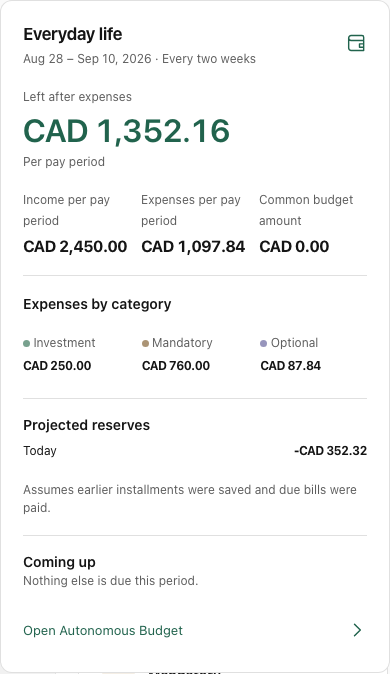
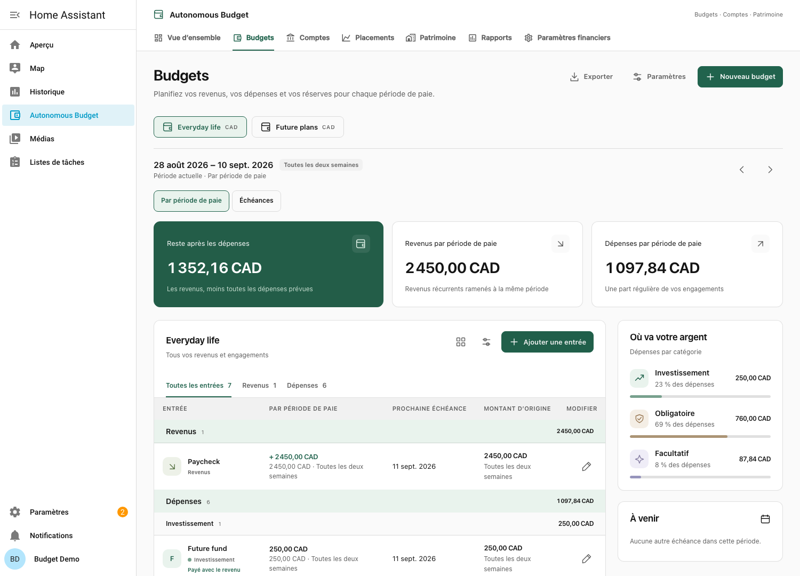

<div align="center">

# Autonomous Budget

**Your money, on your schedule. Right inside Home Assistant.**

Plan budgets, reconcile accounts, track investments and see your net worth — together or independently.

[](https://github.com/raccommode/AutonomousBudget-HomeAssistant/actions/workflows/ci.yml)
[](https://github.com/raccommode/AutonomousBudget-HomeAssistant/releases)
[](https://hacs.xyz/docs/faq/custom_repositories/)
[](LICENSE)

[](https://my.home-assistant.io/redirect/hacs_repository/?owner=raccommode&repository=AutonomousBudget-HomeAssistant&category=integration)
[](https://my.home-assistant.io/redirect/config_flow_start/?domain=autonomous_budget)

</div>



## New in 1.0: accounts, investments and wealth

Use **budgets alone**, **accounts and wealth alone**, or connect them. Private account journals, custom expense categories, splits, reconciliation, CSV/OFX/QFX/QIF imports, multicurrency reports, portfolios, property and loan schedules now live beside the existing planner. Optional Lunch Flow synchronization, Yahoo/CoinGecko quotes and Frankfurter exchange rates can be enabled independently.

Open **Overview, Budgets, Accounts, Investments, Assets, Reports or Finance settings** in the sidebar panel. Modules can be hidden without deleting their data. No budget or payday is required for accounts.

**[Read the accounts and wealth guide →](docs/FINANCE.md)** — setup, import formats, investment operations, privacy, dashboard cards, backup/restore and Lunch Flow validation status.



## The budget planner

- **Multiple budgets.** Give each budget a name and currency: everyday life, a project, or a future plan.
- **Shared budgets.** Split common expenses by percentage between personal budgets. Each person gets an automatic mandatory contribution on their own pay schedule, kept in sync with the shared budget.
- **Your own rhythm.** Daily, weekly, every two weeks, monthly, or yearly. Each budget can optionally set its own pay period and payday. Leave them empty to use the global defaults; two weeks is the initial default.
- **Grouped entries.** Income appears first, followed by expenses grouped as Investment, Mandatory, and Optional. Each group shows its total for the selected calculation view; older expenses awaiting classification stay in a separate group.
- **Income and expenses.** Every entry has a money-flow direction. Income has no category. Each expense has one of three categories: **Investment**, **Mandatory**, or **Optional**.
- **Recurring commitments.** Add Netflix, rent, a paycheck, or a savings contribution with its amount, currency, renewal date, and frequency. One-time entries, end dates, and pausing are supported too.
- **A plan for each payday.** Compare income and expenses on the same time scale, then switch to **Due dates** to see actual scheduled cash flow. Browse previous and upcoming periods using the two arrow buttons.
- **Progressive reserves.** See the projected amount set aside for each recurring expense, its next renewal, and completed / remaining pay periods.
- **Optional available balance.** Enter an account balance and credit owed per budget to estimate what remains after projected reserves. Balances can be manual, left empty, or supplied by explicit account allocations.
- **Home Assistant dashboards.** A bundled visual card with an optional common-budget amount and 14 independent display controls, plus eleven native monetary sensors per budget. No separate card download or manual resource registration.
- **Local storage.** Your budgets stay in Home Assistant. No cloud account or bank connection is required. External data providers are optional; there is no telemetry or runtime CDN dependency.
- **English and French.** The panel, forms, dashboard card, messages, and sensor names follow your Home Assistant language. Your own budget and entry names are never translated.
- **Export.** Download your budget definitions as a readable JSON file.

## Install with HACS

Requires **Home Assistant 2026.8.0 or newer** and a working [HACS installation](https://hacs.xyz/docs/use/).

1. Click **Open HACS repository** above, or add the repository manually in **HACS → ⋮ → Custom repositories**:
   - Repository: `https://github.com/raccommode/AutonomousBudget-HomeAssistant`
   - Type: **Integration**
2. Find **Autonomous Budget** in HACS and download it.
3. **Restart Home Assistant.**
4. Click **Add integration** above, or go to **Settings → Devices & services → Add integration → Autonomous Budget**.
5. Choose your default currency and starting module. The budget period and reference date are optional.
6. Open **Autonomous Budget** in the sidebar and create a budget or account.

The buttons open the appropriate screen in your own Home Assistant; you still confirm installation there. The integration is available through a **HACS custom repository**. It is not yet included in HACS's default catalog. No YAML setup is required.

<details>
<summary>Manual installation</summary>

Copy the complete `custom_components/autonomous_budget` folder into your Home Assistant configuration directory:

```text
config/
└── custom_components/
    └── autonomous_budget/
        ├── __init__.py
        ├── manifest.json
        ├── frontend/
        └── …
```

Restart Home Assistant, then add the integration from **Settings → Devices & services**.

</details>

## Your first two-week budget

1. Create a budget named **Everyday life**, with your preferred currency.
2. Optionally select **Every two weeks** as this budget’s pay period and enter a payday as its reference date. You may leave either field empty to inherit its global default.
3. Add your paycheck: **Income**, amount, **Every two weeks**, and a payday as its first due date.
4. Add rent, Netflix, and savings contributions as expenses. Choose **Mandatory**, **Optional**, or **Investment** for each expense.
5. Set the amount and actual renewal date for each entry. **Per pay period** shows the regular budget; **Due dates** shows scheduled payments.
6. Review **Projected reserves** below your entries. Optionally enter an account balance and credit owed in **Edit budget** to see **Available after reserves**.

In **Due dates**, an August 28 payday starts a period running **August 28 through September 10**, inclusive. A Netflix renewal on September 3 is counted in that period; one on September 11 belongs to the next period.

The three category totals describe **expenses only**. Income is uncategorized. Savings contributions entered as expenses reduce the amount left to spend.

## Share a common budget

1. Create a **Personal budget** for each person, using their name (for example **Alex** and **Sam**). Optionally set their own pay period and payday.
2. Create another budget with **Budget type → Shared budget**, named **Shared household**, for example.
3. Add the common expenses with their original amounts, categories, and renewal dates.
4. Open **Manage allocation** and assign a percentage to each personal budget. For a target budget in another currency, enter an explicit planning exchange rate. Individual common expenses can also use another currency with a manual exchange rate.
5. Each personal budget now contains a read-only **Automatic contribution** under **Mandatory**. Its arrow opens the shared budget where you manage expenses and percentages.



For a **CAD 2,600 monthly** common expense, Alex's **60%** share is **CAD 720 every two weeks**; Sam's **40%** share is **CAD 1,040 monthly**. Each contribution uses that person's optional pay schedule, falling back to the global defaults. A person can contribute to several shared budgets.

Contributions share **all expense categories** and do not deduct the common budget's income. The original expense categories remain in the common budget; the aggregate contribution is a mandatory expense in each personal budget. No duplicate income is automatically created in the common budget, and no bank transfer is initiated.

Amounts update when expenses, percentages, exchange rates, names, or pay schedules change. Paused and ended commitments are excluded using the same rules as the regular plan. One-time expenses are shared once, in each person's period containing the bill's due date; their share is included in the contribution scheduled at the **start of that period**. Due dates therefore shows the person's planned contribution date, while the original bill stays on its actual due date in the common budget. Historical and future views remain projections of the current definitions.

Percentages support two decimal places and may total up to **100%**. A partial allocation shows the unallocated percentage. Set a person's share to zero to unlink it. Deleting a personal budget removes its allocation without increasing anyone else's percentage; deleting the common budget removes its automatic contributions. Allocations cannot link to another common budget. For the same period and expense total, rounding remainders are distributed deterministically so a full allocation does not create or lose a cent. Different pay frequencies can produce small annual rounding differences.

With participants configured, **common reserves** advance on each participant's own paydays strictly between the previous and next bill dates, following the ALVES model. Installments through today count as projected savings; the bill's due date starts the next reserve cycle. Each personal budget also reserves its **full contribution for the current pay period** unless it is paid on a scheduled income date, with a dedicated line in Projected reserves. This amount resets from the new period’s contribution on payday, and stays tied to today when browsing past or future periods. A one-time common expense is included only during the person’s period containing that expense. The common budget separately projects savings for its own bills. An unallocated common budget uses its own pay schedule for the usual reserve estimate. These are theoretical savings, not recorded transfers; record actual contributions in linked accounts, or update manual balances when using budgets alone.

Shared and personal budgets both work with the existing dashboard card and eleven sensors. Exports keep allocation definitions and omit automatic contribution rows, which are regenerated from the common budget.

### How periods and recurring entries work

| Setting | Behavior |
| --- | --- |
| Daily | One calendar day in Home Assistant's timezone |
| Weekly | Seven days, aligned to the reference date |
| Every two weeks | Fourteen days, aligned to a payday or other reference date |
| Monthly | From the reference day to the same day next month |
| Yearly | From the reference month/day to the following year |

Use the first of the month or January 1 as the reference for calendar months or calendar years. Each budget can set its own period and reference date independently. Both fields are optional: an empty field uses the corresponding global default. Changing a default affects only budgets that inherit it. Each budget keeps its own currency.

Entry frequencies are **One time, Daily, Weekly, Every two weeks, Monthly, Quarterly, and Yearly**. Recurrence begins on the first due / renewal date and never creates earlier payments. An end date is inclusive. When a month has fewer days, the due date moves to that month's final day and returns to the original day when possible: January 31 → February 28/29 → March 31.

**Due dates** counts payments actually scheduled inside the selected period. Existing v0.1.0 sensors keep this calculation. Editing, pausing, or deleting entries changes past and future projections; these are not an immutable transaction history. Unspent money does not automatically roll over.

### A regular plan per payday

The default **Per pay period** view normalizes recurring income and expenses using the same convention as the ALVES budgeting system:

| Entry | Amount in a two-week plan |
| --- | --- |
| CAD 10 daily | CAD 140.00 |
| CAD 140 weekly | CAD 280.00 |
| CAD 2,000 every two weeks | CAD 2,000.00 |
| CAD 280 monthly | CAD 129.23 (`280 × 12 ÷ 26`) |
| CAD 130 quarterly | CAD 20.00 (`130 × 4 ÷ 26`) |
| CAD 520 yearly | CAD 20.00 (`520 ÷ 26`) |

The planning convention uses 364 daily periods, 52 weeks, 26 two-week periods, 12 months, 4 quarters, or 1 year. Calendar scheduling still uses real dates, including leap years and years with 27 paydays. For other pay periods, the same frequency ratios apply. Converted amounts are rounded per entry before totals are added.

Active recurring commitments enter the regular plan even before their first renewal, so you can prepare for future bills. They leave the plan once no occurrence remains on or after the selected period's start. **One-time entries** contribute their full amount only in the period when due. Paused entries contribute nothing. Expense categories use the selected view's calculation; income remains uncategorized.

### Expenses paid on an income date

An expense due on the same calendar date as a positive, active income in the **same budget** is treated as paid directly with that income. It contributes **zero to projected reserves**. Its amount, expense category, scheduled cash flow, per-pay-period plan, and common-budget amount stay unchanged.

The expense remains visible at its original amount, with **Paid with income** and **Not included in projected reserves** in the reserve list. It does not show a misleading zero expense amount or a reserve progress bar. The negative reserve total, available balance, dashboard card, and native sensors all use the adjusted calculation.

The comparison uses actual scheduled dates, including recurrence, month-end adjustments, first due dates, inclusive end dates, and one-time income. Paused income, zero income, and income from another budget do not qualify. A budget's reference date alone is not an income entry. The rule follows dates, regardless of whether the income covers all expenses on that date.

For an ordinary recurring bill, the comparison targets its **next renewal**. It is checked again each cycle: a February 28 match does not automatically exclude a March 31 bill. For an automatic common contribution, it uses the **start of the current personal pay period**, when that contribution is scheduled, rather than the next payday. These decisions stay tied to today when browsing past or future periods. Pausing or moving an income restores reserves for expenses that no longer match.

### Projected reserves and available money

Reserves follow ALVES's installment model, using each budget's effective pay period and reference date. They represent what should already be set aside, assuming earlier installments were saved and due bills were paid. They are **estimates, not tracked savings or bank transactions**.

For each recurring expense:

1. Find its next due date strictly after today. On the due date, the projection rolls forward to the following renewal; an ended expense has no remaining reserve.
2. Determine the planned installment count: the pay frequency divided by the expense frequency, rounded up to a whole number, with a minimum of one. Monthly bills with biweekly pay therefore have three planned installments; yearly bills have 26.
3. Count future paydays after today and **on or before** the next due date, capped at the planned count. Completed installments are the planned count minus those remaining.
4. Project the reserve as `expense amount × completed installments ÷ planned installments`, rounded in the budget currency. Rounding the final fraction prevents accumulated installment-rounding errors.

For example, a CAD 280 monthly bill due January 31, with biweekly pay anchored to January 31, has a CAD 93.33 reserve on February 1 toward February 28: one of three installments, with two future paydays left. Its regular two-week allocation is CAD 129.23. The regular allocation and the reserve installment differ because monthly cycles do not contain a fixed whole number of two-week pay periods. On rollover, the reserve can start partially funded when fewer future paydays remain than the planned count.

Daily, weekly, monthly, and yearly pay periods use the same method. The reference date may be in the past or future and is never forced to a particular weekday. One-time entries have no automatic reserve. Except for the income-date rule above, reserves cover the **next renewal of each recurring expense**, not every payment before the next payday. The reserve view always uses **today**, even when browsing another period.

Optionally enter **Account balance** and **Credit owed** in the budget currency:

`Available after reserves = account balance − credit owed + projected reserves`

Reserves are negative deductions in the panel, card, and native sensor (for example **−CAD 120.00**); zero stays **CAD 0.00**. With a CAD 100 account and CAD 20 credit owed, a −CAD 120 reserve gives **−CAD 40 available**. Progress, target bill amounts, and installment amounts remain positive.

Zero balances and negative available amounts are preserved; account overdrafts are allowed. Credit owed must be nonnegative. Leave the account balance empty to hide the estimate. Update manual balances yourself when using budgets alone. In linked mode, allocated ledger balances supply these values; the journal can optionally synchronize with Lunch Flow. No external bank transfer is initiated.

### Currencies

Choose a currency for each budget and each entry. When they differ, supply a manual exchange rate: **1 entry-currency unit = X budget-currency units**. For example, a USD 10 subscription with a rate of 1.35 contributes CAD 13.50 to a CAD budget. These planning rates remain manual. The optional account/reporting module can retrieve dated exchange rates independently.

Amounts use decimal arithmetic and the supported currency's minor units, including zero-decimal JPY and three-decimal KWD. Each converted payment is rounded before aggregation. You cannot change the currency of a budget containing entries; create another budget instead. See [`CURRENCIES`](custom_components/autonomous_budget/const.py) for the supported list.

## Add a dashboard card

The integration registers its card automatically, including on YAML dashboards. After initial installation, refresh the browser.

1. Edit a dashboard and choose **Add card**.
2. Search for **Autonomous Budget**.
3. Select a budget in the visual editor. Optionally customize the title and choose the calculation view, and show or hide expense categories, upcoming payments, and projected reserves.



You can also open the grid button beside a budget's name to get its ready-to-paste YAML:

```yaml
type: custom:autonomous-budget-card
budget_id: YOUR_BUDGET_ID
view: plan # or cashflow
show_reserves: true
show_categories: true
show_upcoming: true
```

`budget_id` is optional and defaults to the first available budget. Use a specific ID to keep the card tied to that budget. Optional `title` overrides its heading. A deleted budget displays an explicit message instead of silently switching to another budget.

### Native sensors and automations

Each budget is a device with eleven monetary sensors:

| Sensor | Current-period value |
| --- | --- |
| Income | Scheduled incoming money |
| Expenses | All scheduled expenses |
| Remaining | Income minus expenses |
| Investment expenses | Expenses categorized as Investment |
| Mandatory expenses | Expenses categorized as Mandatory |
| Optional expenses | Expenses categorized as Optional |
| Income per pay period | Normalized income in the regular plan |
| Expenses per pay period | Normalized expenses in the regular plan |
| Remaining per pay period | Normalized income minus normalized expenses |
| Projected reserve | Total projected reserve for recurring expenses as of today |
| Available after reserves | Manual account balance minus credit owed and projected reserves; unknown until an account balance is entered |

For the reserve sensor, click **Home Assistant entity** beside the total in **Projected reserves**. The dialog shows the actual entity ID and ready-to-paste dashboard YAML, and **Open entity** opens its native Home Assistant details. Every budget already exposes this sensor, including when the projected reserve is zero; no optional account balance is required.

You can also find all entity IDs in **Settings → Devices & services → Autonomous Budget**. Each sensor includes `budget_id`, `metric`, `calculation`, `reserve_date`, effective `period`, `reference_date`, `period_start`, and exclusive `period_end` attributes. IDs remain stable when you rename a budget. Sensors update on edits and at local midnight, and can be used in built-in cards, templates, history, and automations.

```yaml
# Replace these example IDs with the entities from your installation.
type: entities
title: Household budget
entities:
  - sensor.everyday_life_income
  - sensor.everyday_life_expenses
  - sensor.everyday_life_remaining
```

See [dashboard and automation examples](docs/dashboards.md) for more.

## Language

The integration supports **English** and **French**. It automatically follows the language selected in your Home Assistant profile. Unsupported languages fall back to English. Monetary amounts and dates use the corresponding display format; changing language never changes stored amounts, currencies, or user-provided names.

<details>
<summary>French interface</summary>



</details>

## Data and access

Unlinked legacy budgets retain household read/export access and administrator-only editing. New accounts are private by default with named Read/Edit sharing. A linked budget inherits the intersection of its source accounts’ audiences, including common-budget relationships. Private financial cards use the viewer’s authenticated access. New account sensors are opt-in because native Home Assistant states are more widely accessible.

Data lives in `.storage/autonomous_budget.sqlite`. The upgrade keeps the original store and writes a pre-migration JSON backup before migrating. Home Assistant configuration backups include the database and its audit history. Application JSON exports omit connection keys; the server administrator and server backups remain outside the application's privacy boundary. See [storage and privacy details](docs/FINANCE.md).

## Updating from an earlier version

Download **1.0.1** in HACS, restart Home Assistant, and refresh open browser tabs. Existing budgets become personal budgets by default; shared allocations are opt-in. Existing budgets, entry IDs, amounts, schedules, reserves, and manual balances are preserved. Five planning/reserve sensors are added when upgrading from 0.1.0.

This corrects the category direction in earlier releases: **income has no category; expenses have categories**. Existing income categories are removed automatically. Earlier uncategorized expenses appear as **To categorize**: edit each one and choose Investment, Mandatory, or Optional. No category is guessed for an old expense. These entries continue contributing to total expenses, remaining money, and reserves while awaiting a category; their unassigned amount is shown separately in the breakdown.

The three category sensors now measure expenses. Their entity IDs remain stable, so an existing ID may still end in `_income`; their displayed names and values are corrected. Prior Recorder history remains as recorded under the earlier calculation. Existing income, expense, and remaining calculations stay the same. In 0.4.0, reserves are negative deductions and personal reserves include the full current common-budget contribution. Existing reserve sensor IDs stay the same; their earlier Recorder history keeps its original sign. No storage reset is needed.

The sidebar and custom card now default to **Per pay period**. Choose **Due dates**, or set `view: cashflow` on the card, for the earlier cash-flow display. The new balance fields are empty until you enter them.

## Troubleshooting

- **Integration not found:** check the folder is named `autonomous_budget` under `custom_components`, then restart Home Assistant.
- **Sidebar or card missing:** verify the integration loaded under Devices & services, then refresh the browser. Check Home Assistant logs for `autonomous_budget`.
- **Unexpected period:** check the budget’s optional pay period and reference date, its inherited defaults, and your Home Assistant timezone.
- **Different totals between views:** the regular plan normalizes recurring amounts; Due dates counts actual scheduled payments. Future commitments can appear in the plan before their first renewal.
- **Missing due-date amount:** check the entry is active and its renewal falls inside the period. Future first due dates do not backfill earlier payments.
- **Available balance unknown:** enter an optional account balance in Edit budget. Zero is a valid balance.
- **Another session changed the budget:** close the editor and reopen it to work from the latest saved data.

[Report a bug](https://github.com/raccommode/AutonomousBudget-HomeAssistant/issues/new?template=bug_report.yml) or [suggest a feature](https://github.com/raccommode/AutonomousBudget-HomeAssistant/issues/new?template=feature_request.yml).

## Development

See [CONTRIBUTING.md](CONTRIBUTING.md) for local setup, the real Home Assistant test instance, automated checks, and architecture. The runtime uses Python and native browser modules, with no frontend build step. The optional Yahoo quote adapter uses the declared yfinance Python dependency.

Released under the [MIT License](LICENSE). This is an independent community integration.
