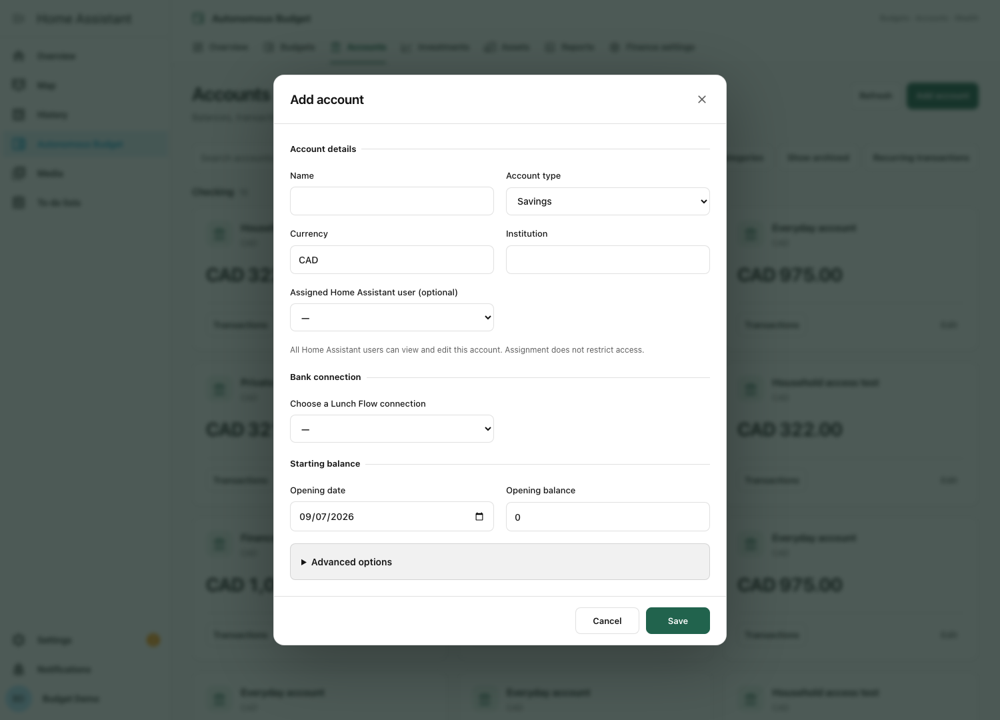
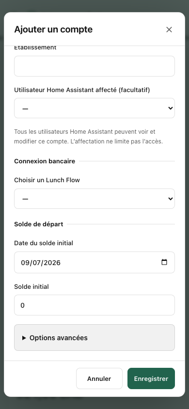

# Interface design

Autonomous Budget uses one financial workspace across Overview, Budgets, Accounts, Investments, Assets, Reports and Finance settings. The interface is implemented in the integration itself and uses no hosted fonts, trackers or frontend services.

## Direction and references

The overview/detail hierarchy draws on [Monarch's reports](https://help.monarch.com/hc/en-us/articles/21846787088916-Using-Reports); the separation of planning, category groups and recurring commitments draws on [YNAB](https://www.ynab.com/). These are interaction references, not copied assets or an affiliation. Existing Autonomous Budget colors and Home Assistant components remain the foundation.

## Shared rules

| Element | Rule |
| --- | --- |
| Navigation | One persistent module bar with a visible current page, icon and label; horizontal scrolling on mobile. Hidden modules retain their data. |
| Page | One title, a useful description, and a consistent action area. A primary action is filled green; supporting actions are neutral. |
| Cards | Shared borders and 12px corner radius; 16–24px spacing; larger text reserved for financial totals. |
| Amounts | Tabular digits, explicit currency and right-aligned table amounts. A missing value is an em dash; a real zero remains zero. Currency codes wrap as a word. |
| Forms | Visible labels, related fields grouped under legends, investment-only fields shown when relevant, advanced options disclosed on demand. |
| Feedback | Empty errors are hidden; populated errors have an alert role. Save confirmation uses a live status region. Pending and reconciliation states have text as well as color. |
| Accessibility | Keyboard focus, native dialogs with accessible titles, first-field focus, Escape/Cancel, native checkbox/select behavior and larger mobile controls. |
| Mobile | Adapt to the available Home Assistant panel width; scroll wide tables inside their container, keep dialog actions reachable, avoid clipped currency codes. |
| Reports | Summary first, detail on demand. Printing temporarily expands sections and restores their state. No invented valuation history. |
| Themes | Home Assistant colors and local system fonts; shared light/dark tokens and reduced-motion support. Dashboard cards respect HA card themes. |

## Main changes from 1.2.1

The former budget screen repeated the brand and used a different heading layout from financial modules. All pages now share the same header. Account cards previously mixed account types without a search control; they now use consistent grouped cards and filters. Account creation formerly placed archiving, sensor publication and investment accounting alongside every basic field and showed an empty error strip. The new form groups related fields and exposes advanced settings separately. Financial settings previously used full-width nested blocks with a generic account subtitle; it now has purpose-specific sections and clearer connection status.

## Implementation

`frontend/ui.js` owns page headers, workspace tokens, common controls, dialog styling, financial table presentation and dashboard card styling. `autonomous-app.js` owns module navigation. Individual panels retain only their module-specific layouts and behavior. `i18n.js` translates interface strings while leaving user-entered names untouched.

The 1.3.0 changes do not migrate financial data or alter budget formulas. Existing card options, account permissions, external-service opt-in, historical amounts and synchronization review remain in place. See [validation](VALIDATION.md) for automated and manual coverage.
