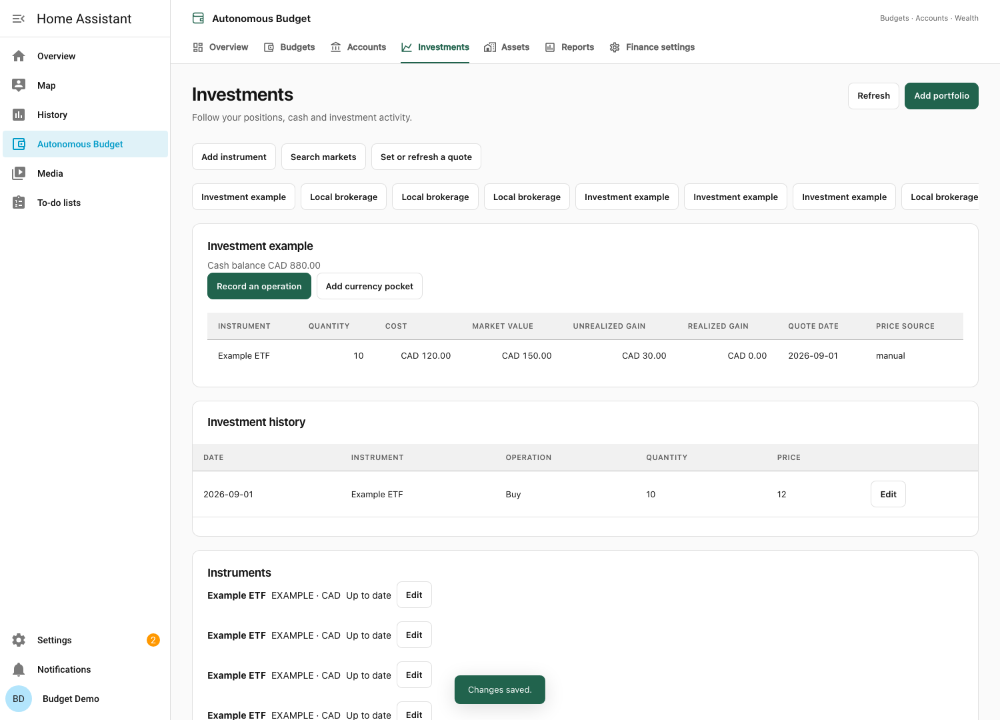
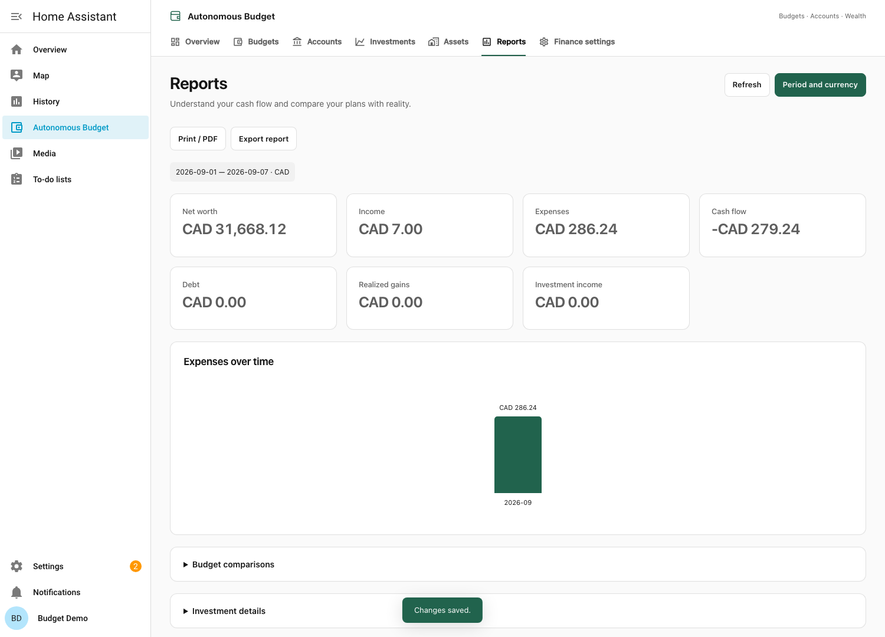

# Accounts, investments and wealth

Autonomous Budget adds a household financial journal alongside the existing household budget planner. You can use budgets, accounts, or both. No budget or payday is required to record transactions or investments.

## Getting started

As a Home Assistant administrator, open **Autonomous Budget → Accounts → Add account**. Optionally assign a Home Assistant user to identify the account holder; leave it empty for an unassigned account. This does not restrict access. Choose checking, savings, cash, credit card, loan, or investment, a currency, and a dated opening balance. Use negative balances for money owed. Manual transactions start on that opening date. Lunch Flow can also retrieve earlier history: those rows are marked **Before opening balance**, remain searchable and categorizable, and do not change the dated opening balance or later reconciliation totals.

Use **Finance settings → Modules and display** to hide modules and choose your reporting currency. Hiding a module keeps its data. The interface follows your Home Assistant profile language (English or French). Names you enter are preserved.


## Finding your way

**Overview** provides a compact summary in your reporting currency, plus shortcuts to individual accounts and budgets. Its totals use the reporting period shown beneath the summary. A missing rate or valuation is called out explicitly.

**Accounts** groups checking, savings, cash, credit, loan and investment accounts separately. Search by account name, institution or assigned user, or narrow the list with the account-type filter. Open **Transactions** for the paginated journal and its search field; use **Filter** for date, status and category criteria.

Account forms group the essential details, optional Lunch Flow connection and dated starting balance. The cost method appears for investment accounts. **Advanced options** contains archiving and optional Home Assistant sensor publication.

**Reports** starts with the period, currency and totals. Expand **Budget comparisons** or **Investment details** as needed; **Detailed breakdowns** includes links to the underlying transactions. Printing includes all sections and restores your previous expanded/collapsed choices afterward.

## Journal and reconciliation

- Enter a date, signed amount, payee, description, notes, and optional original currency, amount and historical exchange rate. Expenses are negative, receipts positive.
- Create expense categories and nested subcategories. Split an operation into several lines; their total must equal the actual account amount exactly. Account categories are separate from the budget planner's three expense groups. Budget income still has no category.
- Link a positive refund to its original expense. Reports reduce expenses by the refund rather than classifying it as new income.
- Use **Transfer** for movements between accounts. Enter both amounts when currencies differ, and any fee separately. Both legs are written atomically; internal transfers are excluded from consolidated income and expenses. Correct a transfer with an opposite transfer so its history remains traceable.
- Search the journal, filter dates/status/categories, and select transactions for bulk status, category or note changes. Lists use 100-row pages; the API caps pages at 500 rows.
- Add payee/description classification rules and recurring templates. **Upcoming occurrences** displays their calendar; **Record occurrence** confirms a payment before posting it. A matching existing transaction must be selected explicitly. Recorded occurrences cannot be posted twice.

**Pending**, **Unmarked**, **Cleared** and **Reconciled** are separate states. Pending bank authorizations do not affect the journal balance. Mark the statement transactions Cleared, then enter the statement's date and closing balance in **Reconcile**. Validation requires an exact zero difference. A closed reconciliation locks its operations. **Reopen** explicitly reopens that statement and subsequent statements for the account; changes are audited. No balancing adjustment is created automatically.

Use **Edit account → Advanced options → Archived** to archive an account. Archived accounts retain their transactions. **Show archived** lets you open them and undo archiving through Edit.

## Multicurrency

Each monetary account has one currency. An investment portfolio has a main cash balance and may have additional currency pockets. A security has its own quotation currency, independent of the portfolio's cash currencies.

Money is stored as decimal strings and calculated with Python Decimal, respecting each currency's minor units. Security quantities, prices and exchange rates retain their decimal precision separately from rounded monetary amounts. A cross-currency trade requires its historical cash conversion rate; a cross-currency transfer retains its two actual account amounts. No total adds unlike currencies without conversion.

Reports use rates dated on or before each historical cash flow. Investment income and realized gains use the event date, while net worth uses the latest price/valuation and exchange rate available on or before the report's end date. Missing information makes the result **Incomplete**; the displayed subtotal includes only known values. It never substitutes zero or a rate of one for missing conversions. An empty holding does not require a current price.

Enter corrections through **Finance settings → Exchange rate**, fetch a dated rate, or use **Get missing exchange rates** in Reports to retrieve historical rates. A manual rate wins over an automatic rate on the same date. Automatic FX uses [Frankfurter](https://frankfurter.dev/) without an API key; **Refresh exchange rates automatically** is opt-in. Budget planning exchange rates remain explicit assumptions and are not overwritten by market rates.

## Imports and Money migration

Use **Accounts → Transactions → Import** and choose CSV, OFX/QFX, or QIF. Microsoft Money migration uses exported files, not proprietary `.mny` files.

1. Choose the local account, file format, date pattern, decimal separator and CSV delimiter.
2. Map column names for CSV. Optional columns include `category_name`, `source_name`, `transfer_account_name`, and investment `action`, `quantity`, `price`, `fee`, `instrument_ref`.
3. Review the paginated preview and line errors. Your selections and mappings are retained between pages; confirmation imports selected rows from every page. Map source accounts, categories, transfer destinations and securities to local records. For a multi-account QIF file, map every source account.
4. Supply actual amounts for transfers between currencies and historical rates for foreign-currency security operations.
5. Select the rows to import. Duplicate external IDs/fingerprints are skipped. Potential matches to manual entries start unchecked; select a row only when it is a separate real transaction. Valid rows can be imported after explicitly acknowledging errors.

CSV supports bank transactions and the named investment actions below. OFX/QFX recognizes bank statement rows plus stock/fund/bond purchases and sales, income, reinvestment and splits. QIF recognizes bank/cash/card/asset/liability records, category splits, bracketed account transfers, and Buy, Sell, Div, IntInc, ReinvDiv, ReinvInt, ShrsIn and StkSplit investment records. Unsupported investment operations are reported before confirmation. Inspect the preview for your export dialect; file extensions do not guarantee identical schemas.

Imports are limited to 10 MB per file and run off Home Assistant's event loop. Import into accounts with an appropriate opening date. Do not include already-counted opening-balance transactions. Reimporting the same supported file does not create duplicates. Two sides of the same QIF transfer are linked as one movement.

## Investments

Create a portfolio and instruments under **Investments**. Instruments include stocks, ETFs, funds, bonds and cryptocurrencies, with a symbol, market, optional ISIN and quote currency. Search Yahoo Finance or CoinGecko, or enter instruments manually.

Record opening positions with acquisition cost, buys, sells, fees, dividends, reinvestments, interest, coupons, splits and security transfers. Purchases and sales update the security position and selected portfolio cash pocket in one transaction. Reinvestment changes holdings without inventing a separate cash receipt. Selling or transferring more than the position held is rejected, including when a backdated edit would invalidate a later operation.

Average cost is the default; FIFO is selectable per portfolio. Security transfers preserve acquisition costs and transferred lots. The portfolio shows quantity, acquisition cost, market value, unrealized/realized gain, quote date and source. Investment history supports correction and deletion of eligible operations; reconciled cash legs must first be reopened. Security transfers are corrected by recording an inverse transfer.



Quotes are optional:

- [yfinance](https://ranaroussi.github.io/yfinance/) accesses publicly available Yahoo Finance data for covered international instruments. Yahoo's data terms and personal-use restrictions apply; this is not an official Yahoo service or a guaranteed market feed.
- [CoinGecko's keyless public API](https://docs.coingecko.com/docs/keyless-public-api) supplies covered cryptocurrency prices using CoinGecko coin IDs.
- Manual prices remain available for every instrument, including unsupported bonds.

Enable automatic quotes per instrument for daily refreshes, or refresh manually. Requests use a cache and rate-limit cooldown; the background scheduler checks every six hours and skips instruments already refreshed that local day. Network failures keep the last saved price. Prices show their original dates; no historical market series is invented before the first available quote.

Bonds have nominal value, coupon rate/frequency, first coupon date and maturity. **Bond schedule** shows projected coupons and principal repayment per bond. Record actual receipts separately; projections do not post journal transactions. The reports are financial tracking tools and do not produce tax returns.

## Assets and loans

Under **Assets**, record real estate and other property, currency and percentage owned. Add dated valuations; only your ownership share enters net worth. Link related journal receipts/expenses through **Related asset**. The application does not manage tenants or rental arrears.

Loan definitions refer to a monetary account. Enter principal, payment, first payment date, nominal annual rate, payment frequency (monthly, every two weeks or weekly), and compounding frequency. Add dated rate changes and extra principal payments. The projected schedule splits interest and principal, handles changes within a payment period and stops when the balance is repaid. **Record payment** records actual principal as a transfer to the debt account, and interest/fees as expenses. The current implementation requires the payment account to use the loan's currency; use an explicit FX transfer first when needed.

Schedules remain forecasts. Net debt comes from the actual loan account journal, not the forecast. Enter its opening debt as a negative balance.

## Personal overview

**Overview** shows only active accounts and budgets explicitly assigned to the signed-in Home Assistant user. Choose **Assigned Home Assistant user (optional)** in **Edit account** or **Edit budget**. An unassigned account or budget remains available in its module but is absent from personal overviews. Existing budgets are unassigned after upgrading; select their users when ready. Assignment does not restrict household access or change shared-budget contributions, reserves or native entity publication.

The overview uses the latest received bank balance for connected accounts and the current journal balance for manual accounts, plus investment positions and minus account debts. Missing or stale bank values and missing exchange rates or investment values mark the overview as incomplete. Income and expenses come from the assigned accounts' journal for the current month; they require recorded or imported transactions. Property without account assignment is available in Assets and household Reports, rather than included in this personal account summary. Report date/account filters do not carry over to Overview.

## Reports

Reports provide income/expenses by category, payee, account and budget; cash flow, current/end-date net worth, debt, investment income and realized gains. The selected dates apply to flows; balances and asset values are evaluated at the end date. Select a reporting currency and optional account filter. **Transactions** opens the paginated source operations behind a total. Transfers and investment cash legs are excluded from ordinary expense/income totals; investment results are reported separately.

Charts, CSV exports and **Print / PDF** are included. Use your browser's print dialog to save a PDF. Historical net worth uses only prices and valuations actually available by that date; missing history is clearly incomplete.



## Linking budgets

An administrator can use **Finance settings → Link an account** to assign an explicit percentage of a cash or credit account to a budget. An account's allocations across budgets must total at most 100%; a budget can receive several accounts. Existing allocations can be updated or removed by any authenticated Home Assistant user. Investment accounts, cash pockets inside a portfolio, and property do not automatically become spendable budget money.

In a linked budget, allocated ledger cash and credit debt replace the manual balance fields for the available-after-reserves estimate. They are converted into the budget currency. Forecast amounts and negative reserves are preserved. An expense is excluded from projected reserves only when its frequency and the matching positive income’s frequency both equal the budget’s pay period, with a payment on the same date. Bills with other frequencies retain their installments even when they fall on payday.

Balance percentages do **not** split transactions. Assign each transaction or split explicitly to a linked budget and, optionally, a planned entry. **Planned versus actual** compares scheduled payments within the report period to recorded flows. Actual operations never rewrite forecasts or projected reserves.

Common budgets may contribute to personal budgets in other currencies. **Manage allocation** requires an explicit planning rate for each different target currency. Actual payments retain their own historical journal amounts/rates.

## Optional Lunch Flow

Use a **Personal API** destination from [Lunch Flow](https://www.lunchflow.app/docs/api/personal-api-overview). Its API key is separate from all other functions; no key is required for manual accounts, imports, investments, reports or budgets.

1. Create a Lunch Flow API destination and enable the remote accounts you want to expose.
2. In **Finance settings → Connect Lunch Flow**, save the key. It stays in the server database, is redacted from API responses, and is omitted from JSON exports and audit payloads.
3. Open **Accounts → Add account**. If an enabled connection exists, **Choose a Lunch Flow connection** lets you select it and then an available remote account. Complete the local account details and save to create and link the account together. Leave the connection empty for a manual account; no provider fields appear without an enabled connection. To link an existing unlinked account, use **Edit account**. The currencies must match. The integration requests all available history, with no start-date field; the bank/provider determines how far back it can supply data. Existing links retain their previous import boundary until saved again.
4. Each saved link appears in **Accounts**, on the account card and journal, as **Remote account is linked to Local account**, with the connection name. To disconnect, open **Edit account**, select **Disconnect this account from Lunch Flow**, and save. Cancelling leaves the connection unchanged. Imported history is retained. **Rename** changes the connection name without requesting its key again.
5. The current bank balance is fetched immediately. **Synchronize** beside the account link refreshes it, including before the first transaction import. Choose **Review transactions**, inspect the preview, then confirm to begin importing the journal. Daily synchronization refreshes bank snapshots for all links and imports transactions only for links whose initial review was confirmed. Finance settings also provide connection-wide synchronization.

Sync deduplicates external IDs, distinguishes pending rows, and proposes matches with nearby manual transactions. Ambiguous matches or missing stable bank IDs become review conflicts. Categories, split lines, notes and reconciliations are preserved. A bank correction that affects reconciled amounts/dates or split totals needs review; no silent adjustment is used to match the received bank balance.

Account pages and account dashboard cards show the explicitly labeled **Bank balance** for linked accounts. Account pages display **Ledger balance** separately; the journal, reports and linked budget calculations retain their ledger basis. No opening balance or balancing transaction is created to hide a difference. An unavailable bank balance appears as unavailable, or retains the last received value with a warning. A failed transaction request is reported per account and does not block other accounts. When linking an investment account, supported provider holdings automatically appear in **Investments**, including stocks and cryptocurrencies. The latest broker snapshot supplies portfolio quantities and values for net worth; it replaces the local position valuation in that portfolio instead of being added on top. It never writes fictional buys or sells. Existing journal operations remain available in Investment history, and realized income/gain reports continue to require actual journal events. Missing cost basis stays unknown; a missing price makes valuation incomplete. Snapshots carry their retrieval date and are not applied to earlier reports. Later synchronizations update the snapshot; provider unavailability preserves the last received positions. **Initialize positions** requires explicit security mapping and acquisition costs, works only in an empty portfolio, and creates opening positions rather than fictional buys/sells. Disconnecting removes the key and stops synchronization while retaining history and the last dated positions. You can still rename the disconnected connection or disconnect its accounts through Edit account. Optional holdings or balance failures do not block creating the link; the status is shown and subsequent refreshes retry. If neither endpoint provides a currency, the explicitly chosen local currency is used, and bank amounts are only displayed after their currency is verified. Authorization failures remain blocking.

**Validation status:** automated tests use representative Personal API account, transaction, balance and holdings responses, repeated syncs, pending transitions, conflicts and network failures. A live Safari inspection confirmed existing holdings and some missing bank data; the new release has not yet been verified against that live bank connection. Provider-specific export and banking behavior should be checked in the initial preview.

Unavailable balances and holdings are included in synchronization previews and produce **Partial synchronization** after refresh. Account and portfolio screens distinguish unsupported data, missing remote access, rate limits, network failures, provider errors and currency mismatches without exposing raw API responses. Last valid values are retained; an unavailable value is not a confirmed zero. An empty successful holdings response is explicitly shown as **Lunch Flow returned no positions for this account**. Check the bank connection and the accounts enabled for the Personal API destination in Lunch Flow when data is missing.

## Household access and dashboard cards

All authenticated Home Assistant users can view and edit financial data, including accounts created by other users, transactions, portfolios, reports, exports, connections and linked budgets. This also applies to records created before version 1.2.0: old named sharing settings no longer restrict access. Optionally assign an account to a Home Assistant user in **Edit account**; the assignment identifies the holder without changing access. Personal display preferences remain per user.

Only Home Assistant administrators can create accounts, portfolios, budgets, connections and other financial setup records, or restore a backup. Members can enter/import transactions, record investment operations, edit existing records, unlink accounts and manage existing connections. These creation checks run on the server, including WebSocket and file-upload requests. Connection keys remain server-side and are never returned to application users.

Add **Autonomous Finance** from the dashboard card picker. Choose an account or Net worth, a currency and any of the independently configurable blocks:

```yaml
type: custom:autonomous-finance-card
view: wealth
currency: CAD
show_title: true
show_balance: true
show_income: true
show_expenses: true
show_status: true
show_link: true
```

For an account card, use `view: account` and `account_id: <id>` (the visual editor lists household accounts). All new financial cards obtain data using the viewer's authenticated access.

**Native account sensors are opt-in.** Enabling **Publish amounts as Home Assistant sensors** exposes the account total to Home Assistant users and integrations that can read entity states. Linked budget values are withheld unless all funding accounts are explicitly published. Previously published budget entities retain their IDs but become unavailable, with no monetary values or budget attributes, while publication is disabled. Turning publication off removes the current entity; it does not erase already-recorded Home Assistant history or backups. Existing unlinked budget entities keep their IDs and behavior.

The application does not isolate financial data between Home Assistant users or from the server administrator, filesystem access, or backups. No telemetry or external service is contacted by the integration unless the user invokes or enables that provider. Home Assistant installs the declared Python dependency during setup.

## Storage, backup and restore

The SQLite journal lives at `.storage/autonomous_budget.sqlite`. Writes are atomic, indexed, serialized and revision-checked. The pre-1.0 Home Assistant Store remains untouched, and `.storage/autonomous_budget.pre-v1.json` is written before migration. Budget IDs, card configuration, entities and calculations are preserved.

Use **Download backup** in Finance settings for a JSON export of household records, transactions and budget definitions. Connection keys are excluded. Restore validates the file into an empty financial workspace, remaps identifiers, restores records with household access and adds restored budgets separately without replacing existing budgets. Restoring requires an administrator. Reconnect external services and deliberately re-enable any native entity publication afterward.

Application backups include validated bank position snapshots and historical journal rows, so restoring them preserves these balances and valuations. The application export contains the financial state; a normal Home Assistant configuration backup also preserves the database's full audit history, server configuration and legacy migration files. Protect these backups because they can include server-side connection credentials. Take a Home Assistant backup before upgrading or restoring. A malformed restore rolls back the complete database write.

## API and implementation

Budget WebSocket interfaces keep their existing names. Financial requests use `autonomous_budget/finance` with `command`, `payload`, and `revision` for user mutations. Read commands include `snapshot`, `transactions`, `portfolio`, `trades`, `calendar`, `reconciliations`, `reports`, `audit`, `export` and `budgets`. `transactions` accepts `account_id`, `account_ids`, `from`, `to`, `status`, `search`, category/budget/asset filters, `limit` and `offset`, returning `{rows,total}`. `autonomous_budget/finance_subscribe` sends invalidations only; clients fetch their own authorized data.

Authenticated file operations use `POST /api/autonomous_budget/finance_file` for `import_preview`, `import` and `restore` so backups are not constrained by WebSocket request frame size. Preview requests accept `preview_offset` and `preview_limit` (100 by default, maximum 500); responses include row/error counts and column-mapping metadata. `excluded_lines` can retain selections across pages without truncating the committed file. Uploads are limited to 128 MB; import content is limited to 10 MB. Large imports and all SQLite/network work run asynchronously or in Home Assistant's executor, not on its event loop.
